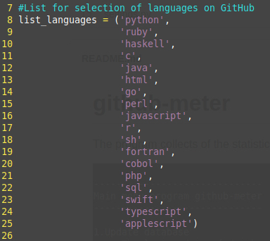
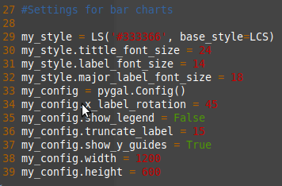
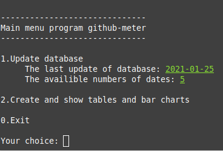
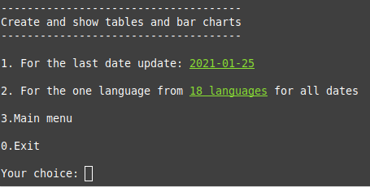
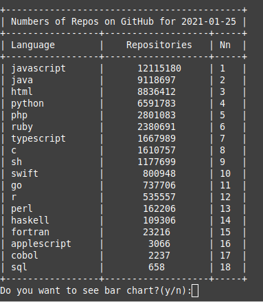
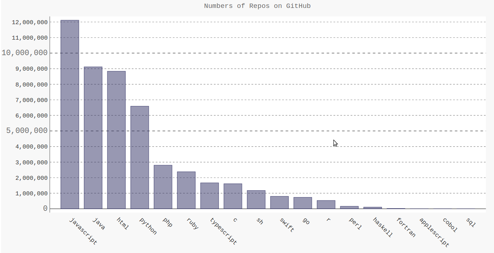
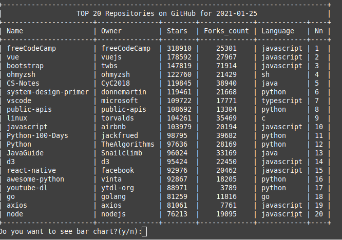
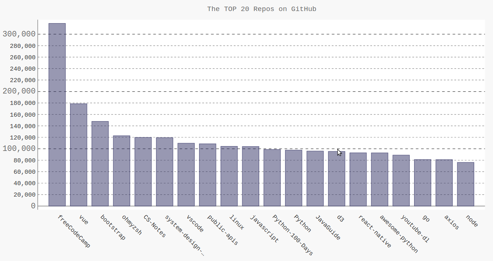

# github-meter

**About:** The program collects of the statistics for github by github api

**Description:** The program does the parsing github by github api. It create(if you touch program in the first time) and fills the database for pre-installed languages in file "settings.py". The file "github.db" with database is created in program's directory. The used database is sqlite3. Results of the program are tables by a python's library "prettytable" and bar charts by a python's library "Pygal". There are settings of bar charts in file "settings.pyt" also.

  

The list of preinstall languages in the file "settings.py"

  

Settings of bar charts in the file "settings.py"

  

The main menu

  

The second menu

  

The table of counts repositories for languagesu

  

The bar chart of numbers repositories for languages

  

The table of the top 20 repositories for languages

  

The bar chart of the top 20 repositories for languages

