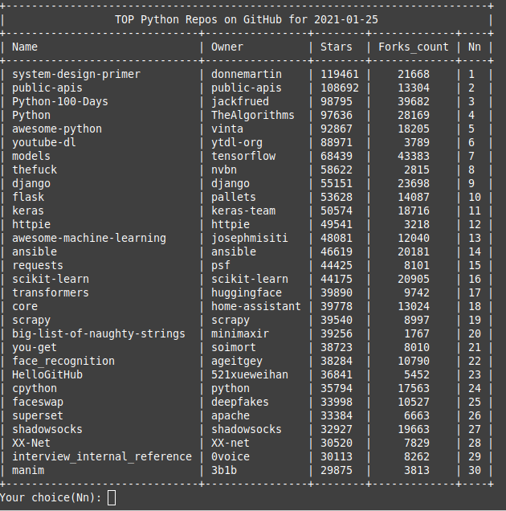
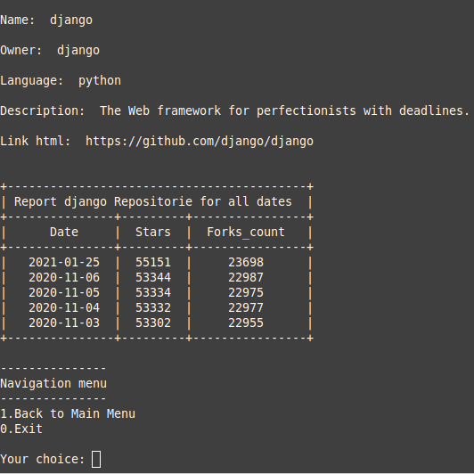

# github-meter

**About:** The program collects of the statistics for github by github api

**Description:** The program does the parsing github by github api. It create(if you touch the program in the first time) and fills a database for pre-installed languages from a file "settings.py". A file "github.db" with database is created in the program's directory. The used database is sqlite3. Results of the program are tables by a python's library "prettytable" and bar charts by a python's library "Pygal". There are settings of bar charts in the file "settings.py" also. 

**You can get the following information:**
1. The rating of pre-installed languages depending on the number of repositories
2. The top 20 repositories for all pre-installed languages depending on the number of forks
3. The top 30 repositories for the one select language depending on the number of forks
4. The short information for the one select repository

<b>Installation for Linux*:</b>

1. Clone the repository (or download the zip file and extract it):

    $ `git clone git@github.com:maninserg/github-meter.git`

2. Go to the directory of the program:
   
    $ `cd <your name of directory>`

2. Create of a virtual environment:

    $ `python3 -m venv .venv`

3. Activate the virtual environment:

    $ `source .venv/bin/activate`

3. Install necessary packages using pip according to the requirements.txt file from a directory with the program:

    (.venv) $ `pip install -r requirements.txt`

<i>*The installation for MacOS or Windows can be other</i>

**Screenshots:**

  

The list of preinstall languages in the file "settings.py"

  

Settings of bar charts in the file "settings.py"

  

The main menu

  

The second menu

  

The table of counts repositories for languagesu

  

The bar chart of numbers repositories for languages

  

The table of the top 20 repositories for languages

  

The bar chart of the top 20 repositories for languages

  

The table of the top 30 repositories for one select language

  

The short information for the one select repository

